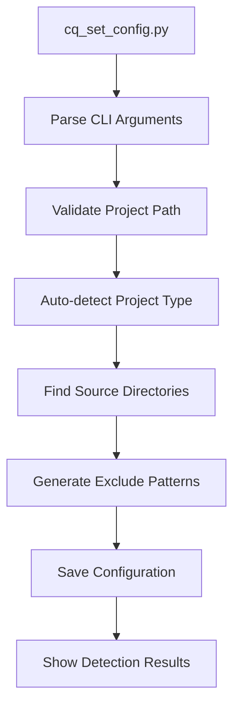
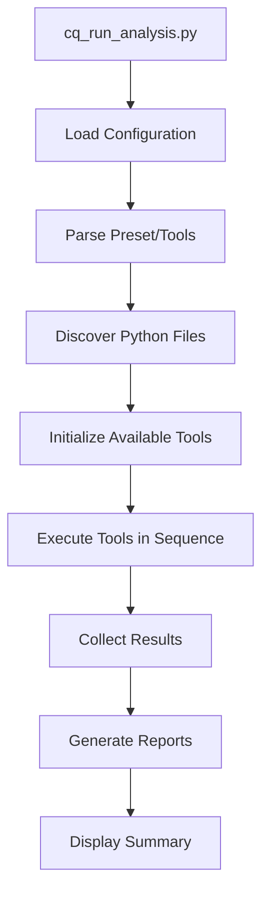
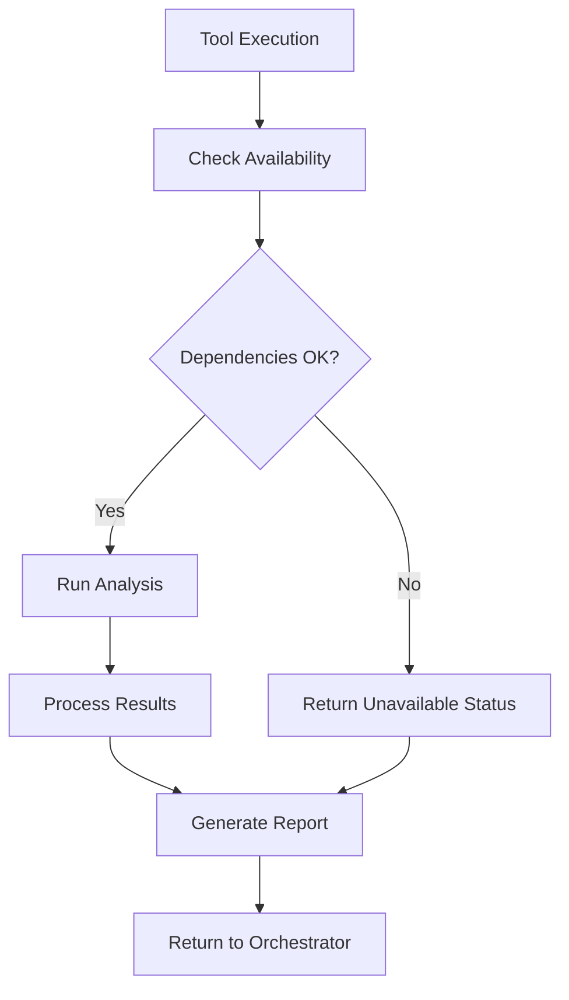

# 🏗️ Architecture & Contributing Guide

## 🏗️ **System Architecture**

### **Modern 2-Step Design Philosophy**

The Code Quality Combined suite follows a clean separation of concerns:

1. **Configuration Phase** (`cq_set_config.py`)
   - Project detection and analysis
   - Smart include/exclude pattern generation
   - JSON configuration persistence

2. **Execution Phase** (`cq_run_analysis.py`)  
   - Tool orchestration and execution
   - Report generation and aggregation
   - Multiple execution modes

### **Design Principles**
- **🔧 Modularity**: Each tool is independent and can run separately
- **📋 Configuration-driven**: All project settings stored in JSON
- **🚫 No side effects**: Tools don't modify the analyzed codebase
- **⚡ Graceful degradation**: Missing tools don't break the analysis
- **📊 Structured output**: All reports in machine-readable JSON format

---

## 📁 **File Organization**

```
code-quality-suite/
├── 🔧 cq_set_config.py         # Step 1: Project configuration
├── 🚀 cq_run_analysis.py       # Step 2: Analysis execution  
├── 📁 helper_scripts/          # Individual analysis tools
│   ├── code_metrics.py         # File structure analysis
│   ├── docstring_coverage.py   # Documentation analysis
│   ├── pylint_analysis.py      # Code quality analysis
│   ├── unused_code.py          # Dead code detection
│   ├── test_coverage.py        # Coverage analysis
│   └── api_documentation.py    # API doc analysis
├── 📁 utils/                   # Shared utilities
│   ├── __init__.py
│   ├── config_manager.py       # Configuration handling
│   ├── project_detector.py     # Auto-detection logic
│   ├── file_finder.py          # File discovery
│   └── report_generator.py     # Report management
├── 📋 cq_active_config.json    # Active project configuration
├── 📊 cq_reports/              # Generated analysis reports
│   ├── analysis_summary.json   # Overall summary
│   ├── code_metrics_report.json
│   ├── docstring_report.json
│   ├── pylint_report.json
│   ├── unused_report.json
│   ├── test_coverage_report.json
│   └── api_doc_report.json
├── 📄 requirements.txt         # Core dependencies
├── 📖 README.md               # Main documentation
├── 📖 EXAMPLES.md             # Usage examples
├── ⚡ PERFORMANCE.md          # Performance guide
├── 🚨 TROUBLESHOOTING.md      # Issue resolution
└── 🏗️ ARCHITECTURE.md        # This file
```

---

## 🔧 **Core Components**

### **Configuration Manager (`utils/config_manager.py`)**

**Responsibilities:**
- Load and save configuration from `cq_active_config.json`
- Validate configuration parameters
- Provide default values for missing settings

**Key Methods:**
```python
class ConfigManager:
    def load_config() -> dict
    def save_config(config: dict) -> None
    def validate_config(config: dict) -> bool
    def get_default_config() -> dict
```

### **Project Detector (`utils/project_detector.py`)**

**Responsibilities:**
- Auto-detect project type (Django, Flask, FastAPI, Generic)
- Identify source directories automatically
- Generate smart exclude patterns

**Detection Logic:**
```python
class ProjectDetector:
    def detect_project_type(project_path: str) -> str
    def find_source_directories(project_path: str) -> List[str]
    def generate_exclude_patterns(project_path: str) -> List[str]
    def get_framework_specific_excludes(framework: str) -> List[str]
```

### **File Finder (`utils/file_finder.py`)**

**Responsibilities:**
- Discover Python files based on include/exclude patterns
- Apply filtering rules consistently across tools
- Handle symbolic links and permissions

**Core Logic:**
```python
class FileFinder:
    def find_python_files(
        project_path: str, 
        include_dirs: List[str], 
        exclude_patterns: List[str]
    ) -> List[str]
    
    def apply_filters(files: List[str], patterns: List[str]) -> List[str]
    def is_python_file(file_path: str) -> bool
```

### **Report Generator (`utils/report_generator.py`)**

**Responsibilities:**
- Standardize report format across all tools
- Generate summary reports
- Handle report persistence and metadata

**Report Structure:**
```python
class ReportGenerator:
    def create_tool_report(
        tool_name: str,
        status: str,
        data: dict,
        execution_time: float
    ) -> dict
    
    def create_summary_report(tool_reports: List[dict]) -> dict
    def save_report(report: dict, filename: str) -> None
```

---

## 🛠️ **Tool Architecture**

### **Base Tool Interface**

All analysis tools follow a consistent interface:

```python
class BaseAnalysisTool:
    def __init__(self, config: dict):
        self.config = config
        self.project_path = config['project_path']
        self.python_files = config['python_files']
    
    def run_analysis(self) -> dict:
        """Execute the analysis and return results"""
        pass
    
    def is_available(self) -> bool:
        """Check if tool dependencies are available"""
        pass
    
    def get_tool_info(self) -> dict:
        """Return tool metadata"""
        pass
```

### **Tool Implementation Examples**

#### **Code Metrics Tool**
```python
class CodeMetricsTool(BaseAnalysisTool):
    def run_analysis(self) -> dict:
        # Count files, lines, functions, classes
        metrics = {
            'total_files': len(self.python_files),
            'total_lines': self._count_lines(),
            'functions': self._count_functions(),
            'classes': self._count_classes()
        }
        return metrics
    
    def _count_lines(self) -> int:
        # Implementation details
        pass
```

#### **Pylint Tool**
```python
class PylintTool(BaseAnalysisTool):
    def run_analysis(self) -> dict:
        # Run pylint on Python files
        result = subprocess.run([
            'pylint', '--output-format=json'
        ] + self.python_files, capture_output=True)
        
        return self._parse_pylint_output(result.stdout)
    
    def is_available(self) -> bool:
        try:
            subprocess.run(['pylint', '--version'], capture_output=True)
            return True
        except FileNotFoundError:
            return False
```

---

## 🔄 **Execution Flow**

### **Configuration Phase Flow**



### **Analysis Phase Flow**



### **Tool Execution Flow**



---

## 📊 **Data Flow & Formats**

### **Configuration Format**
```json
{
    "project_path": "/path/to/project",
    "project_type": "django",
    "include_directories": ["myapp", "core", "utils"],
    "exclude_patterns": [
        "venv", "__pycache__", "migrations", 
        "static", "media", "*.pyc"
    ],
    "timestamp": "2024-01-15T10:30:45Z",
    "auto_detected": true
}
```

### **Tool Report Format**
```json
{
    "tool_name": "pylint",
    "status": "success",
    "execution_time": 15.7,
    "timestamp": "2024-01-15T10:30:45Z",
    "data": {
        "score": 8.5,
        "issues": [
            {
                "type": "warning",
                "message": "Line too long",
                "file": "myapp/models.py",
                "line": 42
            }
        ]
    },
    "metadata": {
        "tool_version": "2.15.0",
        "files_analyzed": 167,
        "total_lines": 7781
    }
}
```

### **Summary Report Format**
```json
{
    "analysis_metadata": {
        "timestamp": "2024-01-15T10:30:45Z",
        "project_name": "my-django-app",
        "project_root": "/Users/john/my-django-app",
        "total_execution_time": 45.2
    },
    "tools_executed": [
        {
            "name": "code_metrics",
            "status": "success",
            "execution_time": 0.5
        }
    ],
    "summary_stats": {
        "total_files": 167,
        "lines_of_code": 7781,
        "success_rate": 100.0
    }
}
```

---

## 🚀 **Adding New Analysis Tools**

### **Step 1: Create Tool Script**

Create `helper_scripts/your_tool.py`:

```python
#!/usr/bin/env python3
"""
Your Tool Analysis
Analyzes [what your tool does]
"""

import sys
import json
from pathlib import Path

# Add utils to path for imports
sys.path.append(str(Path(__file__).parent.parent / 'utils'))

from config_manager import ConfigManager

class YourTool:
    def __init__(self, config):
        self.config = config
        self.project_path = config['project_path']
        self.python_files = config['python_files']
    
    def is_available(self):
        """Check if tool dependencies are available"""
        try:
            # Check for your tool's dependencies
            import your_dependency
            return True
        except ImportError:
            return False
    
    def run_analysis(self):
        """Execute your analysis"""
        if not self.is_available():
            return {
                'status': 'unavailable',
                'message': 'Tool dependencies not installed'
            }
        
        try:
            # Your analysis logic here
            results = self._perform_analysis()
            
            return {
                'status': 'success',
                'data': results
            }
        except Exception as e:
            return {
                'status': 'error',
                'message': str(e)
            }
    
    def _perform_analysis(self):
        """Your specific analysis implementation"""
        # Implement your tool's logic
        return {
            'your_metric': 42,
            'files_analyzed': len(self.python_files)
        }

def main():
    """Main execution function"""
    config = ConfigManager.load_config()
    tool = YourTool(config)
    result = tool.run_analysis()
    print(json.dumps(result, indent=2))

if __name__ == '__main__':
    main()
```

### **Step 2: Register Tool in Main Script**

Add to `cq_run_analysis.py`:

```python
AVAILABLE_TOOLS = {
    # ... existing tools ...
    'your_tool': {
        'name': 'Your Tool',
        'description': 'Analyzes [your tool description]',
        'script': 'helper_scripts/your_tool.py',
        'category': 'quality'  # or 'metrics', 'documentation'
    }
}

PRESETS = {
    # ... existing presets ...
    'your_preset': ['code_metrics', 'your_tool']
}
```

### **Step 3: Add Dependencies**

Update `requirements.txt` if needed:
```txt
# ... existing dependencies ...
your-tool-dependency>=1.0.0  # Optional: your_tool
```

### **Step 4: Test Your Tool**

```bash
# Test tool independently
python3 helper_scripts/your_tool.py

# Test with main script
python3 cq_run_analysis.py --tools your_tool

# Test availability detection
python3 -c "
from helper_scripts.your_tool import YourTool
tool = YourTool({})
print('Available:', tool.is_available())
"
```

---

## 🤝 **Contributing Guidelines**

### **Code Standards**

#### **Python Style**
- Follow PEP 8 guidelines
- Use type hints where appropriate
- Maximum line length: 88 characters (Black formatter)
- Use docstrings for all public functions

#### **File Structure**
- Keep tool scripts in `helper_scripts/`
- Put shared utilities in `utils/`
- Use relative imports for internal modules
- Follow existing naming conventions

#### **Error Handling**
```python
# Good: Graceful error handling
try:
    result = risky_operation()
    return {'status': 'success', 'data': result}
except SpecificError as e:
    return {'status': 'error', 'message': str(e)}

# Bad: Unhandled exceptions
result = risky_operation()  # Could crash entire analysis
return result
```

### **Testing Requirements**

#### **Tool Testing**
```bash
# Test with various project types
python3 cq_set_config.py --project /path/to/django-project
python3 cq_run_analysis.py --tools your_tool

python3 cq_set_config.py --project /path/to/flask-project  
python3 cq_run_analysis.py --tools your_tool

# Test edge cases
python3 cq_set_config.py --project /empty/project
python3 cq_run_analysis.py --tools your_tool
```

#### **Integration Testing**
```bash
# Test with existing presets
python3 cq_run_analysis.py --preset quick
python3 cq_run_analysis.py --preset comprehensive

# Test interactive mode
python3 cq_run_analysis.py --interactive
```

### **Documentation Requirements**

#### **Tool Documentation**
- Add usage examples to `EXAMPLES.md`
- Document performance characteristics in `PERFORMANCE.md`
- Add troubleshooting info to `TROUBLESHOOTING.md`
- Update main `README.md` if adding to core tools

#### **Code Documentation**
```python
def your_function(param: str) -> dict:
    """
    Brief description of what the function does.
    
    Args:
        param: Description of the parameter
        
    Returns:
        dict: Description of return value
        
    Raises:
        YourError: When this specific error occurs
    """
```

### **Pull Request Process**

1. **Fork & Branch**
   ```bash
   git checkout -b feature/your-tool-name
   ```

2. **Implement & Test**
   ```bash
   # Implement your tool
   python3 helper_scripts/your_tool.py
   
   # Test integration
   python3 cq_run_analysis.py --tools your_tool
   
   # Test multiple project types
   ```

3. **Document Changes**
   - Update relevant documentation files
   - Add examples and troubleshooting info
   - Update README if needed

4. **Submit PR**
   - Clear description of what your tool does
   - Examples of usage
   - Test results with different project types
   - Performance impact assessment

### **Code Review Checklist**

**Functionality:**
- [ ] Tool follows base interface pattern
- [ ] Graceful error handling for missing dependencies
- [ ] Returns consistent JSON format
- [ ] Works with different project structures

**Quality:**
- [ ] Follows existing code style
- [ ] Includes appropriate documentation
- [ ] No breaking changes to existing tools
- [ ] Performance impact is acceptable

**Integration:**
- [ ] Tool can be run independently
- [ ] Works with existing presets
- [ ] Interactive mode integration
- [ ] Report generation works correctly

---

## 🔧 **Advanced Customization**

### **Custom Presets**

Create organization-specific presets by modifying `cq_run_analysis.py`:

```python
CUSTOM_PRESETS = {
    'security': ['pylint', 'bandit', 'safety'],
    'documentation': ['docstrings', 'api_doc', 'pydoc'],
    'ci_minimal': ['code_metrics', 'pylint'],
    'full_audit': ['code_metrics', 'docstrings', 'pylint', 
                   'unused', 'test_coverage', 'security']
}
```

### **Custom Exclude Patterns**

Extend project detection with organization patterns:

```python
ORGANIZATION_EXCLUDES = {
    'company_name': [
        'vendor/', 'third_party/', 'legacy/',
        '*.generated.py', 'proto_generated/'
    ]
}
```

### **Environment-Specific Configuration**

```python
# Development environment
DEV_CONFIG = {
    'exclude_patterns': ['migrations/', 'tests/'],
    'tools': ['code_metrics', 'docstrings']
}

# Production environment  
PROD_CONFIG = {
    'exclude_patterns': ['tests/', 'examples/'],
    'tools': ['pylint', 'unused', 'security']
}
```

This architecture guide should help contributors understand the system design and add new tools effectively! 🚀 